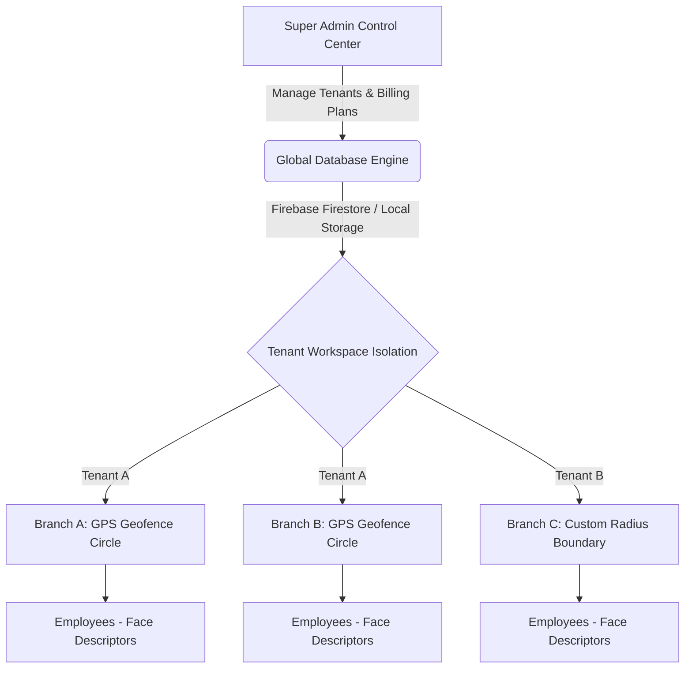
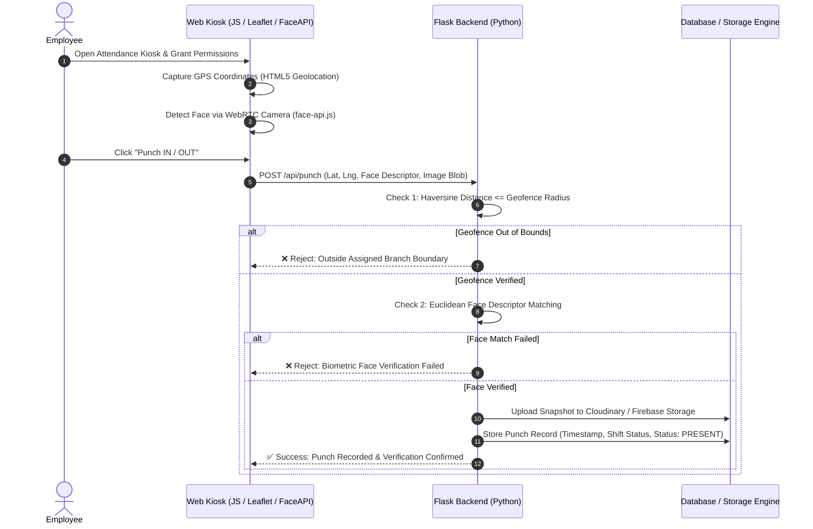

<div align="center">

# 📍 Rudvay-GeoMark

### Enterprise Multi-Tenant Geofenced & AI Face-Verified Attendance Platform

[](https://www.python.org/)
[](https://flask.palletsprojects.com/)
[](https://firebase.google.com/)
[](https://tailwindcss.com/)
[](LICENSE)

</div>

---

## 🌟 Overview

**Rudvay-GeoMark** is a multi-tenant, cloud-native enterprise attendance verification system engineered to combat buddy punching, proxy attendance, and location fraud. Built with **Flask** and powered by dual database options (**Firebase Cloud Firestore** with an automatic **Zero-Config Local JSON Engine** fallback), Rudvay-GeoMark combines real-time **GPS Haversine/Turf.js Geofencing** with **WebRTC AI Face Recognition (face-api.js SSD MobileNet)**.

Whether deployed for corporate offices, retail chains, construction sites, or field force teams, Rudvay-GeoMark delivers precise location checking, biometric face matching, shift/break calculation, shift overtime reporting, and subscription monetization via **Razorpay Payments**.

---

## 🛠 Architecture & Verification Flow

### 1. Multi-Tenant Ecosystem Architecture



### 2. Biometric & Geofence Punch Verification Pipeline



---

## ✨ Key Features Matrix

| Module | Feature Capabilities |
| :--- | :--- |
| **🏢 Multi-Tenant Isolation** | Dynamic tenant registration, isolated branches, departments, shifts, and employee roles. |
| **🌐 Geofencing Enforcement** | Precision GPS calculation using Haversine formula and interactive Leaflet map picker for setting branch coordinates & radius (50m–5000m). |
| **📸 AI Face Recognition** | WebRTC live video feed analysis using `face-api.js` (SSD MobileNet V1 + 68 Landmark Detection) with descriptor matching. |
| **⚡ Hybrid Storage Engine** | Seamless dual-mode architecture: Runs out-of-the-box using the high-performance `LocalFirestoreEngine` or connects to real **Firebase Firestore & Storage** when `firebase_key.json` is present. |
| **⏱ Shift & Break Tracking** | Dynamic work shift definitions, automated break calculation (Lunch/Tea breaks), late arrival tracking, and overtime computation. |
| **💳 Subscription Monetization** | Integrated **Razorpay Subscription Gateway** with webhooks for plan upgrades, multi-currency billing, and tenant quota enforcement. |
| **📊 Reports & Audit Trail** | Interactive attendance reports, status filtering (Present, Late, Absent, On Leave), CSV exports, and detailed security audit logs. |

---

## 📁 Repository Structure

```text
Rudvay-GeoMark/
├── blueprints/                  # Modular Flask Blueprints
│   ├── admin.py                 # Platform Super Admin Routes & Tenant Control
│   ├── api.py                   # REST API for Geofence & Punch Verification
│   ├── employee.py              # Employee Self-Service Kiosk & Punch Handlers
│   └── tenant.py                # Tenant Owner Management Portal
├── static/                      # Static Assets & Client-Side Libraries
│   ├── js/
│   │   ├── camera.js            # WebRTC Camera Control & Canvas Snapshots
│   │   ├── face_detection.js    # face-api.js Models Loader & Feature Extractor
│   │   ├── firebase-init.js     # Client Firebase SDK Configuration
│   │   ├── geofence_map.js      # Interactive Leaflet.js Map Picker & Radius Circle
│   │   └── punch.js             # Client Punch Processing & Geolocation Handlers
│   └── uploads/                 # Local Snapshot Storage Engine (.gitkeep)
├── templates/                   # Jinja2 HTML Templates
│   ├── admin/                   # Super Admin Portal Templates
│   ├── employee/                # Employee Kiosk Templates
│   ├── portal/                  # Tenant Owner Dashboard & Management Views
│   └── base.html                # Global Layout with Tailwind CSS
├── utils/                       # Core Helper Modules
│   ├── attendance_calc.py       # Hours, Overtime & Break Duration Calculations
│   ├── audit_utils.py           # Security Audit Event Logger
│   ├── cloudinary_utils.py      # Cloudinary CDN Image Upload Handler
│   ├── face_utils.py            # Backend Vector Face Descriptor Comparison
│   ├── geo.py                   # Haversine Distance & Geofence Boundary Check
│   ├── razorpay_utils.py        # Subscription Payment Engine & Webhook Verification
│   └── time_utils.py            # Timezone Normalization Utilities
├── app.py                       # Main Flask Application Entrypoint
├── config.py                    # Environment Configuration & Secret Management
├── firebase_config.py           # Dual Driver: Cloud Firebase & Local JSON Storage
├── requirements.txt             # Python Package Dependencies
├── test_system.py               # Automated System Integration Test Suite
├── .env.example                 # Environment Variable Setup Template
├── .gitignore                   # Version Control Exclusion Matrix
└── LICENSE                      # MIT Open Source License
```

---

## 🚀 Getting Started

### Prerequisites

- **Python 3.10** or higher
- **pip** package manager
- Modern Web Browser with Camera & Geolocation support (Chrome, Firefox, Edge, Safari)

### 1. Clone Repository & Setup Virtual Environment

```bash
git clone https://github.com/saiharsha321/Rudvay-GeoMark.git
cd Rudvay-GeoMark

# Create virtual environment
python -m venv venv

# Activate virtual environment
# Windows:
venv\Scripts\activate
# Linux/macOS:
source venv/bin/activate
```

### 2. Install Dependencies

```bash
pip install -r requirements.txt
```

### 3. Environment Configuration

Copy `.env.example` to `.env`:

```bash
cp .env.example .env
```

Edit `.env` to configure your keys (or use the default local fallback mode):

```env
SECRET_KEY=dev-secret-key-change-in-production
PORT=5000
USE_HTTPS=false

# Cloud Services (Optional)
CLOUDINARY_CLOUD_NAME=your_cloud_name
CLOUDINARY_API_KEY=your_api_key
CLOUDINARY_API_SECRET=your_api_secret

# Platform Super Admin Initial Credentials
ADMIN_USERNAME=admin@system.local
ADMIN_PASSWORD=SuperAdminPassword123!
```

---

## 💻 Running the Application

### Option A: Standard Local Server (HTTP)

```bash
python app.py
```
> The application will start on `http://127.0.0.1:5000`

### Option B: HTTPS Mode (Recommended for Camera & Geolocation Access)

Modern browsers require an **HTTPS secure context** to allow camera feeds and high-accuracy GPS geolocation:

```bash
python app.py --https
```
> Flask will start with an ad-hoc SSL certificate on `https://127.0.0.1:5000`

---

## 🧪 Running Automated Tests

Execute the comprehensive system test suite to verify route handlers, geofence formulas, local storage drivers, and Razorpay webhook logic:

```bash
python test_system.py
```

---

## 🌐 Default Demo Credentials

When running in **Local Database Fallback Mode** (`local_db.json`), the system auto-seeds default credentials:

| Portal | URL Path | Username / Email | Password |
| :--- | :--- | :--- | :--- |
| **Super Admin** | `/admin/login` | `admin@system.local` | `SuperAdminPassword123!` |
| **Tenant Owner** | `/portal/login` | `owner@acme.com` | `OwnerPassword123!` |
| **Employee Kiosk** | `/` | *Select Tenant & Enter PIN* | `1234` |

---

## 📜 License

Distributed under the **MIT License**. See [`LICENSE`](LICENSE) for details.

---

<div align="center">
  <sub>Built with ❤️ by <a href="https://github.com/saiharsha321">Sai Harsha</a> & Team Rudvay</sub>
</div>
